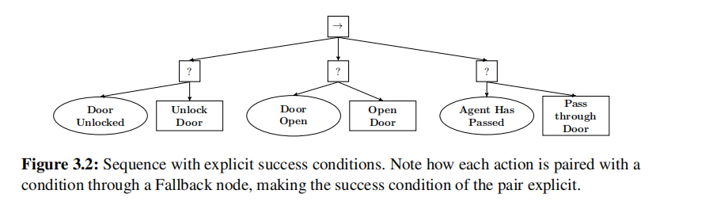
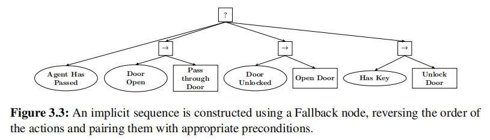
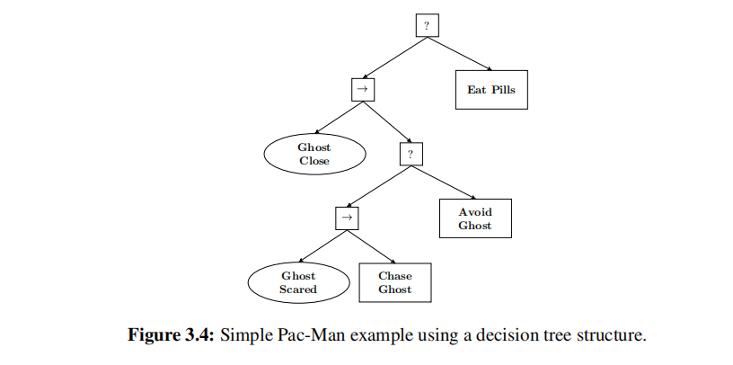

# 行为树设计原则
参考[《Behavior Trees in Robotics and Al: An Introduction》](https://zh.zlibrary-global.se/book/3625258/7c68eb/behavior-trees-in-robotics-and-al-an-introduction.html)

## 原则一：使用显式success判断条件
简单的顺序执行过于死板

通过添加显式成功条件，程序首先进行条件判断，决定是否需要执行某一步骤，可以避免重复操作的问题，提高流畅性。

这里将动作节点称为 `Fallback Node`

## 原则二：使用隐式队列

隐式队列的关键是关注结果（目标是否完成），动作仅仅是完成目标的手段。在隐式队列中，我们首先判断目标是否完成，并将3.2中的Fallback执行改为序列执行。这么做的结果是在不同的情况下程序都可以执行尽可能少的动作。

假设门已经打开，agent就穿过门，并Success

假设门关闭，但agent已经在门后，就直接返回Success

避免了许多不必要的操作

## 原则三：使用决策树结构
原则一，二更像是执行一个复杂的动作，而原则三设计了一种状态（模式）

以吃豆人为例，首先判断鬼是否靠近，附近没有鬼时继续吃豆，有鬼时判断鬼的状态，选择逃离或追赶。
